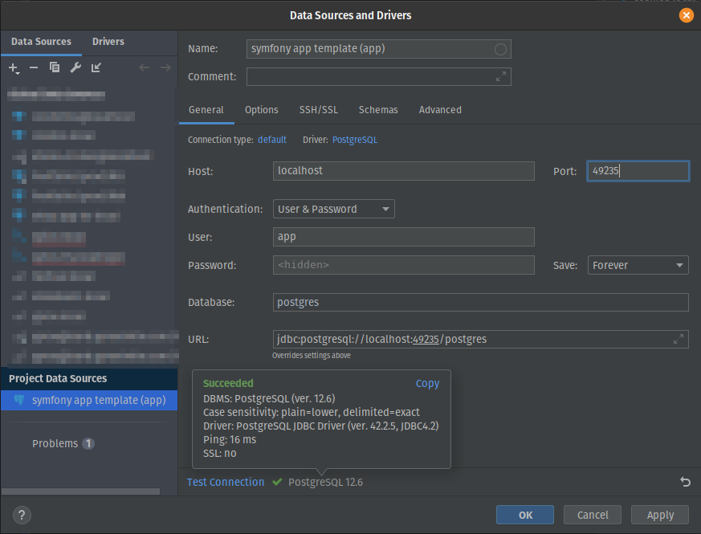
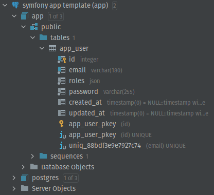
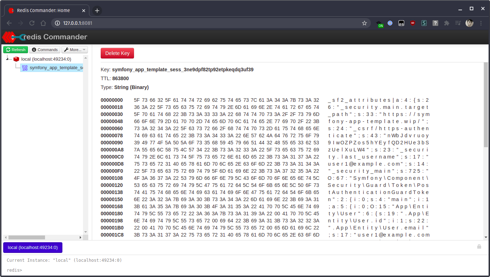

# yProx - App (Docker)

A [Manala recipe](https://github.com/manala/manala-recipes) for projects using the Symfony CLI, PHP, Node.js, PostgreSQL/MariaDB and Redis.

---

## Requirements

* [manala](https://manala.github.io/manala/)
* [Docker Desktop 2.2.0+](https://docs.docker.com/engine/install/)
* Symfony CLI (with [local proxy support](https://symfony.com/doc/current/setup/symfony_server.html#setting-up-the-local-proxy)), PHP and Node.js must be installed by yourself on your machine

## Init

```
$ cd [workspace]
$ manala init -i yprox.app-docker --repository https://github.com/Yproximite/manala-recipes.git [project]
```

## Configure PHP and Node.js versions

Since this recipe relies on having PHP and Node.js by yourself (with phpenv, ondrej's PPA, brew, nvm, etc...),
it's important to create two files `.php-version` and `.nvmrc` which will contains the PHP and Node.js versions to use for your project.

```shell
cd /path/to/my/app
echo 8.0 > .php-version # Use PHP 8.0
echo 14 > .nvmrc # Use Node.js 14
```

Those files will be used by:
- The Symfony CLI when using `symfony php` and `symfony composer` (eg: `symfony php bin/console cache:clear, `symfony composer install)
- NVM when using `nvm use`. If you use ZSH, you can install the plugin [zsh-nvm-auto-switch](https://github.com/aspirewit/zsh-nvm-auto-switch) that will automatically run `nvm use` when encountering a `.nvmrc` file
- GitHub Actions, thanks to [the action `setup-environment`](#github-actions)

**It is important to use `symfony php` and not `php` directly for running commands, thanks to its [Docker integration](https://symfony.com/doc/current/setup/symfony_server.html#docker-integration) 
it automatically exposes environments variables from Docker (eg: `DATABASE_APP_URL`, `REDIS_URL`, ...) to PHP.**

## Quick start

In a shell terminal, change directory to your app, and run the following commands:

```shell
cd /path/to/my/app
manala init --repository https://github.com/Yproximite/manala-recipes.git
Select the "yprox.app-docker" recipe
```

Edit the `Makefile` at the root directory of your project and add the following lines at the beginning of the file:

```makefile
.SILENT:

-include .manala/Makefile

# This function will be called during "make setup"
define setup
    $(call log_and_call, $(MAKE) install-app)
    $(call log_and_call, $(MAKE) init-db@test)
endef

# This function will be called during "make setup@integration"
define setup_integration
    $(call log_and_call, $(MAKE) install-app@integration)
endef
```

Then update the `.manala.yaml` file (see [the releases example](#releases) below) and then run the `manala up` command:

```shell
manala up
```

**Don't forget to run the `manala up` command each time you update the `.manala.yaml` file to actually apply your changes**

From now on, if you execute the `make help` command in your console, you should obtain the following output:

```shell
Usage: make [target] 	

Help:   
  help This help 	

Environment:   
  setup              Setup the development environment   
  setup@integration  Setup the integration environment   
  up                 Start the development environment   
  halt               Stop the development environment   
  destroy            Destroy the development environment 	

Project:
  install-app:             Install application
  install-app@integration: Install application in integration environment
```

## Docker interaction

Initialise Docker Compose containers and your app:
```bash
make setup
```

Start Docker Compose containers:
```bash
make up
```

Stop Docker Compose containers:
```bash
make halt
```

Stop and remove Docker Compose containers:
```shell
make destroy
```

## System

Here is an example of a system configuration in `.manala.yaml`:

```yaml
##########
# System #
##########

system:
    app_name: your-app
    postgresql:
        version: 12
    redis:
        version: '*'
```

## Integration

### GitHub Actions

Since this recipe generates a `docker-compose.yaml` file, it can 
be used to provide a fully-fledged environnement according to your project needs on GitHub Actions.

```yaml
name: CI

on:
    pull_request:
        types: [opened, synchronize, reopened, ready_for_review]

env:
    TZ: UTC

jobs:
    php:
        runs-on: ubuntu-latest
        steps:
            - uses: actions/checkout@v2
            
            # The code of this local action can be found below
            - uses: ./.github/actions/setup-environment

            - uses: shivammathur/setup-php@v2
              with:
                  php-version: ${{ env.PHP_VERSION }} # PHP_VERSION comes from setup-environment local action
                  coverage: none
                  extensions: iconv, intl
                  ini-values: date.timezone=${{ env.TZ }}
                  tools: symfony

            - uses: actions/setup-node@v2
              with:
                  node-version: ${{ env.NODE_VERSION }} # NODE_VERSION comes from setup-environment local action

            - uses: actions/cache@v2
              with:
                  path: ${{ env.COMPOSER_CACHE_DIR }}
                  key: ${{ runner.os }}-composer-${{ hashFiles('**/composer.lock') }}
                  restore-keys: ${{ runner.os }}-composer-

            - uses: actions/cache@v2
              with:
                  path: ${{ env.YARN_CACHE_DIR }}
                  key: ${{ runner.os }}-yarn-${{ hashFiles('**/yarn.lock') }}
                  restore-keys: ${{ runner.os }}-yarn-

            # Will setup the Symfony CLI and build Docker Compose containers
            # No need to create DATABASE_URL or REDIS_URL environment variables, they will be
            # automatically injected to PHP/Symfony thanks to the Symfony CLI's Docker Integration
            - run: make setup@integration

            # Check versions
            - run: symfony php -v # PHP 8.0.3
            - run: node -v # Node.js 14.16.0

            # Run some tests... remember to use "symfony php" and not "php"
            - run: symfony php bin/console cache:clear
            - run: symfony php bin/console lint:twig templates
            - run: symfony php bin/console lint:yaml config --parse-tags
            - run: symfony php bin/console lint:xliff translations

```

This is the code of local action `setup-environment`:
```yaml
# .github/actions/setup-environment/action.yml
name: Setup environment
description: Setup environment
runs:
    using: 'composite'
    steps:
        - run: echo "PHP_VERSION=$(cat .php-version | xargs)" >> $GITHUB_ENV
          shell: bash

        - run: echo "NODE_VERSION=$(cat .nvmrc | xargs)" >> $GITHUB_ENV
          shell: bash

        # Composer cache
        - id: composer-cache
          run: echo "::set-output name=dir::$(composer config cache-files-dir)"
          shell: bash

        - run: echo "COMPOSER_CACHE_DIR=${{ steps.composer-cache.outputs.dir }}" >> $GITHUB_ENV
          shell: bash

        # Yarn cache
        - id: yarn-cache-dir
          run: echo "::set-output name=dir::$(yarn cache dir)"
          shell: bash

        - run: echo "YARN_CACHE_DIR=${{ steps.yarn-cache-dir.outputs.dir }}" >> $GITHUB_ENV
          shell: bash
```

### Common integration tasks

Add in your `Makefile`:

```makefile
# ...

# This function will be called during "make setup"
define setup
    $(call log_and_call, $(MAKE) install-app)
    $(call log_and_call, $(MAKE) init-db@test)
endef

# This function will be called during "make setup@integration"
define setup_integration
    $(call log_and_call, $(MAKE) install-app@integration)
endef

###########
# Install #
###########

## Install application
install-app: composer-install init-db
install-app:
	$(call log_and_call, $(php) bin/console cache:clear)
	$(call log_and_call, yarn install)
	$(call log_and_call, yarn dev)

## Install application in integration environment
install-app@integration: export APP_ENV=test
install-app@integration:
	$(call log_and_call, $(composer) install --ansi --no-interaction --no-progress --prefer-dist --optimize-autoloader)
	$(call log_and_call, yarn install --color=always --no-progress --frozen-lockfile)
	$(call log_and_call, yarn dev)
	$(call log_and_call, $(MAKE) init-db@integration)

################
# Common tasks #
################

composer-install:
	$(call log_and_call, $(composer) install --ansi --no-interaction)

init-db:
	$(call log_and_call, $(php) bin/console doctrine:database:drop --force --if-exists --no-interaction)
	$(call log_and_call, $(php) bin/console doctrine:database:create --no-interaction)
	$(call log_and_call, $(php) bin/console doctrine:schema:update --force --no-interaction) # to remove when we will use migrations
	# $(php) bin/console doctrine:migrations:migrate --no-interaction
	$(call log_and_call, $(php) bin/console hautelook:fixtures:load --no-interaction)

init-db@test: export APP_ENV=test
init-db@test: init-db

init-db@integration: export APP_ENV=test
init-db@integration:
	$(call log_and_call, $(php) bin/console doctrine:database:create --if-not-exists --no-interaction)
	$(call log_and_call, $(php) bin/console doctrine:schema:update --force --no-interaction) # to remove when we will use migrations
	# $(php) bin/console doctrine:migrations:migrate --no-interaction
	$(call log_and_call, $(php) bin/console hautelook:fixtures:load --no-interaction)

reload-db@test: export APP_ENV=test
reload-db@test:
	$(call log_and_call, $(php) bin/console hautelook:fixtures:load --purge-with-truncate --no-interaction)
```


### Tools

#### Admin UI for databases

Databases access can be done through PHPStorm (or DataGrip), credentials can be found in `docker-compose.yaml` file.

##### Primary database

- Username: `app`
- Password: `app`
- Host: `localhost`
- Port : **to dermine**

To determine the port, run `docker-compose ps` and find the one open by Docker for the container `..._database_1`.
Here, it's the port **49235**:

```
     Name                              Command            State            Ports         
-------------------------------------------------------------------------------------------------------
my-app_database_1        docker-entrypoint.sh postgres    Up      0.0.0.0:49235->5432/tcp
my-app_database_test_1   docker-entrypoint.sh postgres    Up      0.0.0.0:49233->5432/tcp
my-app_redis_1           docker-entrypoint.sh redis ...   Up      0.0.0.0:49234->6379/tcp
```





##### Test database

- Username: `test`
- Password: `test`
- Host: `localhost`
- Port : **to determine**

To determine the port, run `docker-compose ps` and find the one open by Docker for the container `..._database_1`.
Here, it's the port **49233**:
```
     Name                              Command            State            Ports         
-------------------------------------------------------------------------------------------------------
my-app_database_1        docker-entrypoint.sh postgres    Up      0.0.0.0:49235->5432/tcp
my-app_database_test_1   docker-entrypoint.sh postgres    Up      0.0.0.0:49233->5432/tcp
my-app_redis_1           docker-entrypoint.sh redis ...   Up      0.0.0.0:49234->6379/tcp
```

#### Admin UI for Redis

It's possible to use [Redis Commander](https://github.com/joeferner/redis-commander) as Redis UI.

After its installation, run `redis-commander` in the folder of your app.
The tool will automatically detects Docker Compose usage and will use the Redis container's port (here **49234**)

Then access http://127.0.0.1:8081, and an UI similar to this should be displayed:
.
